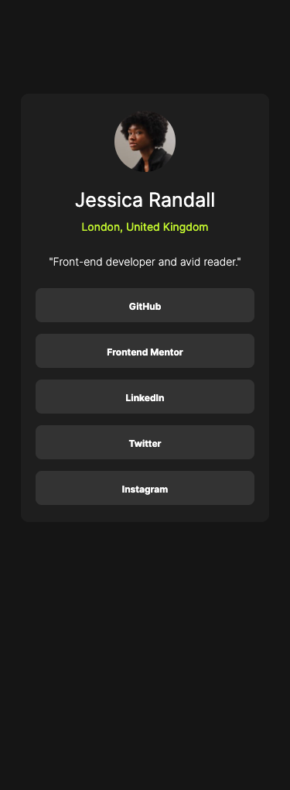
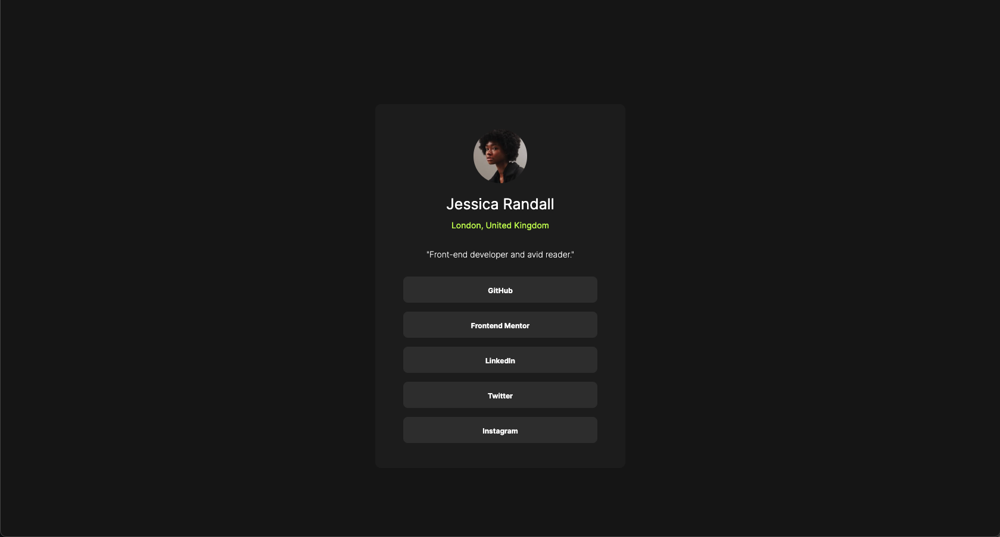
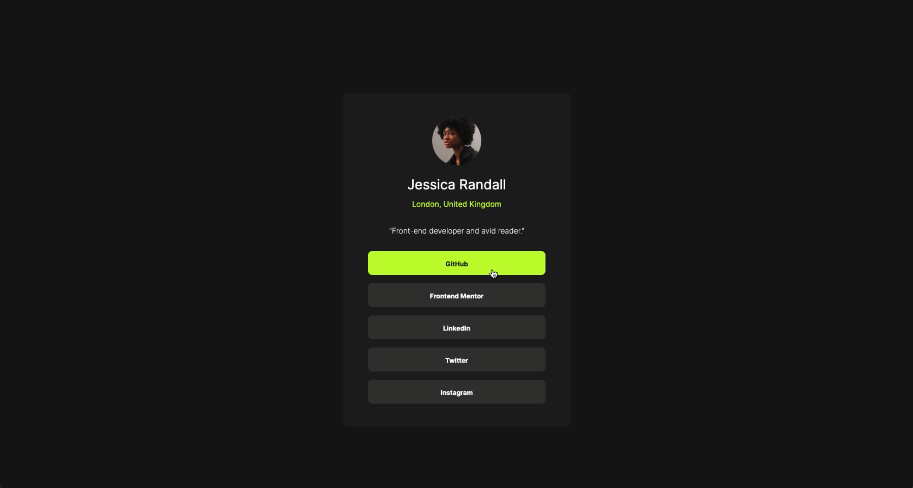

# Frontend Mentor - Social links profile solution

This is a solution to the [Social links profile challenge on Frontend Mentor](https://www.frontendmentor.io/challenges/social-links-profile-UG32l9m6dQ). Frontend Mentor challenges help you improve your coding skills by building realistic projects.

## Table of contents

- [Overview](#overview)
  - [The challenge](#the-challenge)
  - [Screenshot](#screenshot)
  - [Links](#links)
  - [Built with](#built-with)
  - [What I learned](#what-i-learned)
  - [Continued development](#continued-development)
  - [Useful resources](#useful-resources)
- [Author](#author)

## Overview

### The challenge

Users should be able to:

- See hover and focus states for all interactive elements on the page

### Screenshot





### Links

- Solution URL: [GitHub](https://github.com/laurellx/FEM-social-links-profile-main)
- Live Site URL: [Vercel](https://fem-social-links-profile-main.vercel.app/)

## My process

### Built with

- Semantic HTML5 markup
- CSS custom properties
- Mobile-first workflow

### What I learned

I did not have to face any particular issue to realise this project, as I found it very easy; I could maybe highlight one tricky part that came out from the way I structured the html for the links section.
I read online that chosing to create a list of link or a link of buttons is not the same thing, because a link would bring us to somewhere else (although mine do not), while a button is supposed to trigger an action, such as showing additional content, submit a response, etc.
I created an unordered list of links:

```html
<section class="links">
  <ul>
    <li>
      <a href="#" target="_blank"><b>GitHub</b></a>
    </li>
    <li>
      <a href="#" target="_blank"><b>Frontend Mentor</b></a>
    </li>
    <li>
      <a href="#" target="_blank"><b>LinkedIn</b></a>
    </li>
    <li>
      <a href="#" target="_blank"><b>Twitter</b></a>
    </li>
    <li>
      <a href="#" target="_blank"><b>Instagram</b></a>
    </li>
  </ul>
</section>
```

When it came to create the hovering effect on the link box color and the font, due to this structure I had to create two different hovers; one for the background color of the link and one for the text color to change when hovering above the whole link "box":

```css
.links li:hover {
  background-color: hsl(75, 94%, 57%);
  cursor: pointer;
}
.links a {
  color: hsl(0, 0%, 100%);
  text-decoration: none;
  font-size: 12px;
}
li:hover a {
  color: hsl(0, 0%, 8%);
}
```

Without using this syntax (which I found online as mentioned in [Useful resources](#useful-resources)), the font color change would apply only when hovering above the text, not the whole link box.

### Continued development

In future projects I want to practice more the topic of breakpoints and media queries, as I am not too familiar with them and conscious that there might be better solutions; nonetheless, I wish to comprehend better how they function, in case I need to resort to this feature going on.

### Useful resources

- [Stack Overflow](https://stackoverflow.com/questions/14792574/css-child-set-to-change-color-on-parent-hover-but-changes-also-when-hoveredm) - This solution helped me for the hover effect that e needed to be applied not only to the parent element but also on the child (see [aforementioned code snippets](#what-i-learned)).
- [W3 Schools](https://www.w3schools.com/css/css_rwd_mediaqueries.asp) - This article helped me chosing the device breakpoints to make the project responsive.

## Author

- GitHub - [@laurellx](https://github.com/laurellx)
- Frontend Mentor - [@laurellx](https://www.frontendmentor.io/profile/laurellx)
